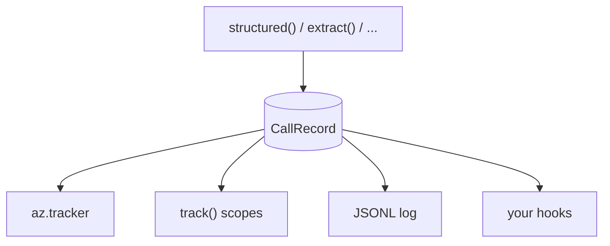

<div align="center">

# llm_utils

**Drop-in, single-file LLM helpers.**<br>
Get validated Pydantic objects back from Azure OpenAI instead of free text, with token counts, cost and a log of
every call built in.

[](https://github.com/utkarsh5026/llm_utils/actions/workflows/ci.yml)
[](https://utkarsh5026.github.io/llm_utils/)
[](https://www.python.org/downloads/)
[](https://microsoft.github.io/pyright/)
[](https://github.com/astral-sh/ruff)
[](LICENSE)

[**Documentation**](https://utkarsh5026.github.io/llm_utils/) ·
[Getting started](https://utkarsh5026.github.io/llm_utils/getting-started/) ·
[Recipes](https://utkarsh5026.github.io/llm_utils/recipes/) ·
[API reference](https://utkarsh5026.github.io/llm_utils/reference/)

</div>

## What it looks like

```python
from pydantic import BaseModel

import azure_openai_utils as az


class Invoice(BaseModel):
    vendor: str
    total: float
    due_date: str | None  # strict mode: optional fields are X | None, not defaults


text = "Invoice #1042 from Acme Corp. Amount due: $1,249.50, payable by 2026-10-31."
res = az.extract(text, Invoice)

res.parsed  # Invoice(vendor='Acme Corp', total=1249.5, due_date='2026-10-31')
res.usage  # Usage(input_tokens=812, output_tokens=41, ...)
res.cost  # 0.00244 (USD, priced from the model Azure reports)
```

You describe the answer as a Pydantic model and get an instance of that model back. No JSON parsing, no regexes
over the model's text, no guessing at token counts.

## Features

<table>
<tr>
<td width="50%" valign="top">

🧩 **[Typed structured output](https://utkarsh5026.github.io/llm_utils/guides/structured-output/)**<br>
Pass a Pydantic model, `list[...]`, `Literal[...]` or an `Enum` and get that exact type back. If validation
fails, the errors go back to the model for another try.

</td>
<td width="50%" valign="top">

🔍 **[One-line extraction](https://utkarsh5026.github.io/llm_utils/guides/extraction/)**<br>
`extract(text, Schema)` pulls fields out of emails, invoices, tickets or contracts, and uses `null` for anything
the text doesn't say.

</td>
</tr>
<tr>
<td width="50%" valign="top">

⚡ **[Batches and async](https://utkarsh5026.github.io/llm_utils/guides/batch-and-async/)**<br>
Run hundreds of prompts at once on a thread pool or with asyncio, and get the results back in input order.

</td>
<td width="50%" valign="top">

💰 **[Token and cost tracking](https://utkarsh5026.github.io/llm_utils/guides/tracking/)**<br>
Input, cached, output and reasoning tokens plus dollars, per process, per model, per tag, or for one block of
code.

</td>
</tr>
<tr>
<td width="50%" valign="top">

📝 **[A log of every call](https://utkarsh5026.github.io/llm_utils/guides/logging/)**<br>
One line turns on a JSONL log of every prompt, answer, status, token count and cost, failed calls included.
Hooks get the same records.

</td>
<td width="50%" valign="top">

🛡️ **[Clear failures](https://utkarsh5026.github.io/llm_utils/guides/errors/)**<br>
Refusals, content filtering, truncation and invalid output each raise their own exception, and every one still
carries the call's usage and cost.

</td>
</tr>
</table>

## Quick start

**1. Copy the module into your project.** It's one file with no imports from the rest of this repo. Keep its
name: calling it `openai.py` would shadow the real `openai` package.

```bash
curl -O https://raw.githubusercontent.com/utkarsh5026/llm_utils/main/azure_openai_utils.py
```

**2. Install its dependencies.**

```bash
pip install "openai>=1.106" "pydantic>=2.8"
pip install azure-identity  # optional: keyless Entra ID sign-in
```

**3. Point it at your deployment.** Settings come from environment variables, so your code holds no secrets.

```bash
export AZURE_OPENAI_ENDPOINT="https://<resource>.openai.azure.com/"
export AZURE_OPENAI_DEPLOYMENT="my-gpt-4o"  # the name you gave the deployment
export AZURE_OPENAI_API_KEY="<your-key>"    # leave unset to sign in with Entra ID
```

That's all the setup: import the module and make your first call, like the
[example above](#what-it-looks-like).

> [!TIP]
> Azure's **v1 API** is used by default, so there's no `api-version` to manage. Set `OPENAI_API_VERSION` or pass
> `api_version=` to switch to the classic `AzureOpenAI` client instead.

## Usage

The snippets below reuse `az` and the `Invoice` model from [the example above](#what-it-looks-like).

### Structured output

```python
from typing import Literal

az.structured("What's on this invoice? ...", Invoice)  # any prompt -> an Invoice
az.extract(text, Invoice, instructions="Use ISO dates.")  # extraction prompt built in
az.structured(text, list[Invoice])  # lists, Literals, Enums, ints...
az.structured(review, Literal["positive", "negative", "neutral"]).parsed
az.structured(text, Invoice, mode="json")  # deployments without structured outputs
az.structured(text, Invoice, temperature=0)  # passed on to chat.completions.create
```

> [!NOTE]
> If the output fails Pydantic validation, including your own `@field_validator`s, the errors are sent back to
> the model for another attempt (`validation_retries=1` by default). Every attempt's tokens are counted.

### Batches and async

```python
results = az.structured_many(texts, Invoice, concurrency=8)  # threads, input order kept
results = await az.astructured_many(texts, Invoice, concurrency=8)  # asyncio
res = await az.astructured(prompt, Invoice)  # az.aextract() works the same way
```

Pass `return_exceptions=True` to collect failures in the results instead of stopping at the first one.

### Tokens and cost

```python
print(az.tracker.summary())  # everything in this process, by model
print(az.tracker.summary(by="tag"))  # grouped by the tag= you passed

with az.track("nightly-eval") as t:  # only calls inside this block
    az.structured_many(texts, Invoice, tag="eval")  # its worker threads count too
t.calls, t.usage, t.cost, t.records

az.set_price("my-deployment", input=..., output=...)  # USD per 1M tokens
```

```text
tracker: global — 50 calls, 1 errors
model              calls   input  cached  output  reasoning   cost($)
gpt-4o-2024-11-20     50  40,600   8,192   2,050          0  0.111760
TOTAL                 50  40,600   8,192   2,050          0  0.111760
```

> [!NOTE]
> Prices come from the built-in `PRICING` table, looked up by the model Azure reports, and cached input is billed
> at the cached rate. Use `set_price()` for Data Zone/Regional deployments or models that aren't listed. A model
> with no price gets `cost=None` and a one-time warning.

### Logging and hooks

```python
az.enable_logging("logs/llm_calls.jsonl")  # content=False drops prompts and outputs
az.structured(question, Invoice, tag="invoices", metadata={"user_id": "u_42"})
rows = az.read_log("logs/llm_calls.jsonl")


@az.add_hook  # or send each record anywhere yourself
def to_db(record: az.CallRecord): ...
```

Every call, failed ones included, produces exactly one `CallRecord`. The same object goes everywhere, so your log
and your cost totals always agree.



<details>
<summary><b>What's in a log line?</b></summary>

<br>

One JSON object per call, pretty-printed here:

```json
{
  "id": "600c74fcc04b4e7f9ca00bc92bd19b43",
  "ts": "2026-09-26T13:00:22.188Z",
  "fn": "extract",
  "deployment": "my-gpt-4o",
  "model": "gpt-4o-2024-11-20",
  "schema": "Invoice",
  "mode": "strict",
  "tag": "invoices",
  "messages": [
    {"role": "system", "content": "Extract the requested information ..."},
    {"role": "user", "content": "Invoice #1042 from Acme Corp. Amount due: ..."}
  ],
  "output": {"vendor": "Acme Corp", "total": 1249.5, "due_date": "2026-10-31"},
  "raw_output": null,
  "status": "ok",
  "errors": [],
  "attempts": 1,
  "usage": {
    "input_tokens": 812,
    "output_tokens": 41,
    "cached_tokens": 0,
    "reasoning_tokens": 0
  },
  "cost_usd": 0.00244,
  "latency_s": 1.214,
  "metadata": {"user_id": "u_42"}
}
```

On a failed call, `output` is `null`, `status` says why, `raw_output` holds the model's last raw text and
`errors` lists every problem.

</details>

### Errors

| Exception | `record.status` | Raised when |
|---|---|---|
| `RefusalError` | `refusal` | the model refused to answer |
| `ContentFilterError` | `content_filter` | Azure's content filter blocked the prompt or output |
| `TruncatedError` | `truncated` | the output was cut off at the token limit |
| `ValidationFailedError` | `invalid` | the output still failed validation after every retry |

All four subclass `StructuredOutputError` and carry `.record`, so the call's usage and cost stay visible. SDK
network and API errors propagate unchanged, after the SDK's own retries.

## One file per provider

Each provider gets its own self-contained module. Copy the one you need; there are no imports between modules.

| Module | Provider | Python | Needs |
|---|---|---|---|
| [`azure_openai_utils.py`](azure_openai_utils.py) | Azure OpenAI | 3.10+ | `openai>=1.106`, `pydantic>=2.8` |

- **Nothing to install from here.** There's no package to publish, version or upgrade. Once copied, the file is
  your code: read it, change it, pin it.
- **Easy to read.** About a thousand lines in numbered sections, with no framework underneath.
- **Tested.** CI runs the suite on Python 3.10–3.14 and on the oldest supported `openai` and `pydantic`.

## Documentation

The full docs live at **[utkarsh5026.github.io/llm_utils](https://utkarsh5026.github.io/llm_utils/)**.

- **Start here:** [Getting started](https://utkarsh5026.github.io/llm_utils/getting-started/) ·
  [Recipes](https://utkarsh5026.github.io/llm_utils/recipes/) ·
  [Troubleshooting](https://utkarsh5026.github.io/llm_utils/troubleshooting/)
- **Guides:** [Structured output](https://utkarsh5026.github.io/llm_utils/guides/structured-output/) ·
  [Extracting data](https://utkarsh5026.github.io/llm_utils/guides/extraction/) ·
  [Batches and async](https://utkarsh5026.github.io/llm_utils/guides/batch-and-async/) ·
  [Tokens and cost](https://utkarsh5026.github.io/llm_utils/guides/tracking/) ·
  [Logging and hooks](https://utkarsh5026.github.io/llm_utils/guides/logging/) ·
  [Handling errors](https://utkarsh5026.github.io/llm_utils/guides/errors/) ·
  [Clients and authentication](https://utkarsh5026.github.io/llm_utils/guides/clients/)
- **Reference:** [API reference](https://utkarsh5026.github.io/llm_utils/reference/), with every public name,
  parameter and field

## Development

```bash
make install  # uv sync + git pre-commit hook
make check    # everything CI runs: ruff, pyright, hygiene, tests, min versions, drop-in
make docs     # preview the docs site (docs/, mkdocs.yml) at http://127.0.0.1:8000
make help     # every other target (fmt, test, cov, live, ...)
```

<details>
<summary><b>CI and the live Azure test</b></summary>

<br>

CI (`.github/workflows/ci.yml`) runs lint, the test suite on Python 3.10–3.14, and the minimum-version and drop-in
checks on every push to `main` and every PR. To run the live Azure test there, add `AZURE_OPENAI_ENDPOINT`,
`AZURE_OPENAI_API_KEY` and `AZURE_OPENAI_DEPLOYMENT` as repository secrets, then trigger the workflow manually with
**live** ticked.

</details>

## License

[Apache-2.0](LICENSE)
