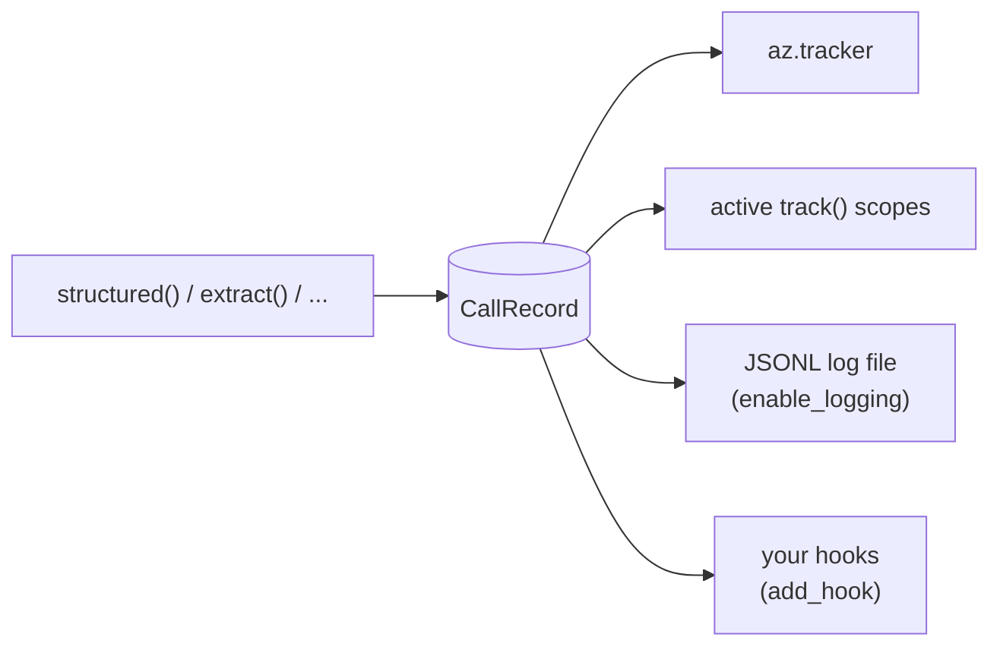

# Logging and hooks

Every call produces one `CallRecord`, including calls that fail. That record goes to the tracker, to the log
file if logging is on, and to any hooks you've registered. Since they all receive the same object, your log
and your cost totals always agree.



## Log every call to a file

```python
import azure_openai_utils as az

az.enable_logging("logs/llm_calls.jsonl")  # creates logs/ if needed and appends one line per call
```

Each call adds one JSON line. Here's one, pretty-printed:

```json
{
  "id": "600c74fcc04b4e7f9ca00bc92bd19b43",
  "ts": "2026-09-26T13:00:22.188Z",
  "fn": "extract",
  "deployment": "my-gpt-4o",
  "model": "gpt-4o-2024-11-20",
  "schema": "Invoice",
  "mode": "strict",
  "tag": "invoices",
  "messages": [
    {"role": "system", "content": "Extract the requested information from the user's text. ..."},
    {"role": "user", "content": "Invoice #1042 from Acme Corp. Amount due: $1,249.50, payable by 2026-10-31."}
  ],
  "output": {"vendor": "Acme Corp", "total": 1249.5, "due_date": "2026-10-31"},
  "raw_output": null,
  "status": "ok",
  "errors": [],
  "attempts": 1,
  "usage": {"input_tokens": 812, "output_tokens": 41, "cached_tokens": 0, "reasoning_tokens": 0},
  "cost_usd": 0.00244,
  "latency_s": 1.214,
  "metadata": {"user_id": "u_42"}
}
```

When a call fails, `output` is `null`, `raw_output` holds the model's last raw text (if there was any),
`status` says what went wrong, and `errors` lists every problem, including each validation failure that led to a
retry.

### Leave out prompts and answers

If prompts may contain personal or confidential data, log only the metadata:

```python
az.enable_logging("logs/llm_calls.jsonl", content=False)
```

This drops `messages`, `output` and `raw_output`, and keeps usage, cost, status, errors, timing, tag and
metadata.

### Turn it off

```python
az.disable_logging()
```

### Read the log back

```python
rows = az.read_log("logs/llm_calls.jsonl")  # list of dicts

failed = [r for r in rows if r["status"] != "ok"]
slowest = max(rows, key=lambda r: r["latency_s"])
spend = sum(r["cost_usd"] or 0 for r in rows)
```

The file is plain JSONL, so pandas, DuckDB and `jq` can all read it:

```python
import pandas as pd

df = pd.read_json("logs/llm_calls.jsonl", lines=True)
df.groupby("tag")["cost_usd"].sum()
```

## Hooks

A hook is a function that receives each `CallRecord` right after the call finishes. Use hooks to send calls
to a database, a metrics system or an alerting channel:

```python
import azure_openai_utils as az


@az.add_hook
def print_expensive_calls(record: az.CallRecord) -> None:
    if record.cost_usd and record.cost_usd > 0.05:
        print(f"expensive call: {record.fn} {record.tag} ${record.cost_usd:.4f}")
```

`add_hook` returns the function, so you can use it as a decorator or call it directly as
`az.add_hook(fn)`. To unregister a hook, call `az.remove_hook(fn)`.

Things to know about hooks:

- **They can't break your calls.** If a hook raises, the exception is logged and skipped, and the call still
  returns normally.
- **They run inline** on the thread that made the call, so keep them fast. For slow work, put the record on a
  queue and handle it elsewhere.
- **They may run concurrently.** Under `structured_many`, hooks are called from several worker threads at
  once, so protect any shared state with a lock.
- `record.to_dict()` gives you a JSON-ready dict, and `record.to_dict(content=False)` leaves out prompts and
  outputs.

For a complete SQLite example, see [Save every call to SQLite](../recipes.md#save-every-call-to-sqlite).

## What's in a `CallRecord`

| Field | Meaning |
|---|---|
| `id` | Unique id of the call (hex UUID). |
| `ts` | UTC start time, ISO-8601. |
| `fn` | Which function made the call: `structured`, `extract`, `astructured_many`, ... |
| `deployment` | The deployment the call went to. |
| `model` | The model Azure reported, e.g. `gpt-4o-2024-11-20`. `None` if no response arrived. |
| `schema` | Name of the schema, e.g. `Invoice`, `ListOfInvoice`, `Choice` (for a `Literal`). |
| `mode` | `strict` or `json`. |
| `tag`, `metadata` | Whatever you passed. |
| `messages` | The conversation as first sent, including system prompts. Your question is here. |
| `output` | The parsed answer as JSON data. Only set when `status == "ok"`. |
| `raw_output` | The model's last raw text when it couldn't be used. |
| `status` | `ok`, `refusal`, `content_filter`, `truncated`, `invalid`, `error` or `cancelled`. |
| `errors` | Every problem encountered, in order. |
| `attempts` | Number of requests made (more than 1 if validation retries happened). |
| `usage` | A `Usage`, summed across attempts. |
| `cost_usd` | Cost in USD, or `None` if the model has no price. |
| `latency_s` | Wall-clock seconds for the whole call. |

## Python `logging`

The module also writes a one-line summary of each call to the standard `azure_openai_utils` logger at
`DEBUG` level:

```python
import logging

logging.basicConfig(level=logging.INFO)
logging.getLogger("azure_openai_utils").setLevel(logging.DEBUG)
```

```text
DEBUG:azure_openai_utils:structured gpt-4o-2024-11-20 status=ok tokens=853 cost=0.00244 latency=1.21s
```

Warnings (such as an unknown model price) and hook or log-write failures are sent to the same logger.
