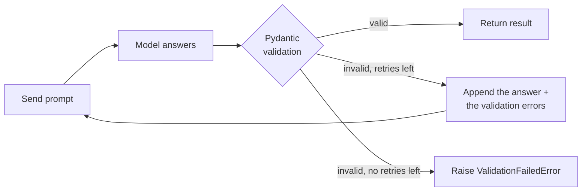

# Structured output

`structured()` is the core of the module. You give it a prompt and a type, and it returns an instance of that
type. Everything else in the module is built on it.

```python
import azure_openai_utils as az

res = az.structured(prompt, schema)
res.parsed  # an instance of `schema`
```

## Describe the answer with a Pydantic model

Write a Pydantic model with the fields you want back:

```python
from pydantic import BaseModel, Field

import azure_openai_utils as az


class Recipe(BaseModel):
    name: str
    servings: int
    ingredients: list[str]
    vegetarian: bool
    prep_minutes: int = Field(description="Hands-on preparation time only, not cooking time")


res = az.structured("Give me a quick weeknight pasta recipe.", Recipe)

recipe = res.parsed
print(recipe.name, "serves", recipe.servings)
for item in recipe.ingredients:
    print(" -", item)
```

By default the call uses Azure's **structured outputs** (`mode="strict"`). The model is constrained to produce
JSON that matches your schema, so the fields are present and have the right types. After that, Pydantic
validates the JSON again on your side.

!!! tip "Field descriptions are prompts"

    `Field(description=...)` is sent to the model as part of the schema. Use it to explain what a field means,
    what units or format to use, or how to handle edge cases. It's often the most effective place to put
    instructions.

### Rules for strict-mode schemas

Azure's strict mode needs every field to be *required*. In practice:

| You want | Write | Not |
|---|---|---|
| A field that may be missing | `due_date: str | None` | `due_date: str = ""` |
| An optional field with a default | `note: str | None = None` | `note: str = "n/a"` |
| A nested object | `address: Address` (another `BaseModel`) | `address: dict` |
| A repeated item | `items: list[LineItem]` | `items: list[dict]` |
| A fixed set of values | `status: Literal["open", "closed"]` or an `Enum` | `status: str` plus a hope |

Defaults other than `None` aren't allowed in strict mode, and neither are free-form `dict` fields. If you need
either, use [`mode="json"`](#json-mode-for-older-deployments).

Nested models work to any depth:

```python
from typing import Literal

from pydantic import BaseModel


class Address(BaseModel):
    street: str
    city: str
    country: str


class Customer(BaseModel):
    name: str
    email: str | None
    tier: Literal["free", "pro", "enterprise"]
    addresses: list[Address]
```

## Types other than models

The schema doesn't have to be a `BaseModel`. Pass any type Pydantic can validate, and `.parsed` is that type:

```python
from enum import Enum
from typing import Literal

import azure_openai_utils as az

# A single label
sentiment = az.structured("The update broke my workflow. Again.", Literal["positive", "negative", "neutral"]).parsed
# 'negative'


# An Enum
class Priority(str, Enum):
    low = "low"
    medium = "medium"
    high = "high"


priority = az.structured("Checkout is down for all users!", Priority).parsed
# <Priority.high: 'high'>

# A number or a boolean
count = az.structured("How many prime numbers are there below 30?", int).parsed
# 10
is_spam = az.structured("Is this spam? 'You WON a free cruise, click here'", bool).parsed
# True

# A list of models
cities = az.structured("List the three largest cities in Japan.", list[Address]).parsed
# [Address(...), Address(...), Address(...)]
```

Behind the scenes, non-model types are wrapped in `{"value": ...}` when sent to the model and unwrapped before
they reach you. You don't need to do anything for this.

| Schema | `.parsed` is |
|---|---|
| `Invoice` (a `BaseModel`) | `Invoice(...)` |
| `list[Invoice]` | `[Invoice(...), ...]` |
| `Literal["a", "b"]` | `"a"` |
| `Priority` (an `Enum`) | `Priority.high` |
| `int`, `float`, `bool`, `str` | `42`, `3.5`, `True`, `"..."` |

## Prompts: a string or a conversation

A plain string becomes one user message. Use `system=` to set the model's role or rules:

```python
res = az.structured(
    "I've been charged twice for my subscription this month.",
    Ticket,
    system="You triage customer support emails for a SaaS company. Be conservative with 'urgent'.",
)
```

For few-shot examples or multi-turn context, pass a list of messages in the standard OpenAI format. If you
also pass `system=`, it's placed before them.

```python
messages = [
    {"role": "user", "content": "Classify: 'Love the new dashboard!'"},
    {"role": "assistant", "content": '{"value": "positive"}'},
    {"role": "user", "content": "Classify: 'Export to CSV has been broken since Tuesday.'"},
]
label = az.structured(messages, Literal["positive", "negative", "neutral"]).parsed
```

A message list can also carry images for vision-capable deployments. See
[Reading data from an image](../recipes.md#read-data-from-an-image).

## Model parameters

Any extra keyword argument goes straight to `chat.completions.create`:

```python
res = az.structured(
    prompt,
    Summary,
    temperature=0.2,
    max_completion_tokens=800,
    seed=7,
)

# Reasoning models (o3, o4-mini, gpt-5, ...)
res = az.structured(prompt, Plan, reasoning_effort="low")
```

`model`, `messages`, `response_format` and `stream` are set by the module itself, so passing them raises
`TypeError`. To choose which model to call, use `deployment=`.

## Choosing a deployment per call

`AZURE_OPENAI_DEPLOYMENT` is the default. You can override it for a single call:

```python
cheap = az.structured(prompt, Label, deployment="gpt-4o-mini-prod")
smart = az.structured(prompt, Analysis, deployment="gpt-5-prod")
```

## Validation retries

The JSON schema can't express every rule. "Total must be positive" or "end date after start date" need
Pydantic validators. When the model's answer fails one of those, the module doesn't give up straight away.
It sends the validation errors back to the model and asks for a corrected answer:

```python
from pydantic import BaseModel, field_validator, model_validator


class Booking(BaseModel):
    guest: str
    nights: int
    check_in: str
    check_out: str

    @field_validator("nights")
    @classmethod
    def at_least_one_night(cls, v: int) -> int:
        if v < 1:
            raise ValueError("nights must be at least 1")
        return v

    @model_validator(mode="after")
    def dates_in_order(self) -> "Booking":
        if self.check_out <= self.check_in:
            raise ValueError("check_out must be after check_in (YYYY-MM-DD)")
        return self


res = az.structured(email_text, Booking, validation_retries=2)
print(res.attempts)  # 1 if the first answer was valid, up to 3 with validation_retries=2
```



- `validation_retries=1` (the default) allows one corrected attempt, so at most 2 requests.
- `validation_retries=0` fails on the first invalid answer.
- `res.usage` and `res.cost` are **summed across all attempts**, so you always see what the call really cost.
- Network errors, rate limits and 5xx responses are a separate matter. The OpenAI SDK retries those itself
  (see [Clients and authentication](clients.md#timeouts-and-network-retries)).

## JSON mode for older deployments

Some older deployments or API versions don't support structured outputs. `mode="json"` works with them. It
puts the JSON schema into the system prompt and asks for a JSON object:

```python
res = az.structured(prompt, Invoice, mode="json")
```

The model isn't *constrained* to the schema in this mode, so validation retries matter more. Pydantic still
validates everything you get back. JSON mode also allows defaults and `dict` fields.

## Tags and metadata

Two optional arguments help you find calls later. They don't change what's sent to the model:

```python
az.structured(
    prompt,
    Invoice,
    tag="invoices",  # group usage and logs by feature
    metadata={"user_id": "u_42", "doc": "inv-1042.pdf"},  # anything JSON-serializable
)
```

`tag` shows up in [`tracker.summary(by="tag")`](tracking.md#group-by-tag), and both appear on every
[log line and hook record](logging.md).

## Tips for better answers

- **Name fields clearly.** `delivery_date` works better than `d2`, because the model reads the field names.
- **Give the model room to think.** For hard judgments, put a `reasoning: str` field *first* in the model. The
  model fills fields in order, so it writes its reasoning before the answer.
- **Prefer `Literal` or `Enum` over free text** for anything you'll branch on in code.
- **Use `| None` generously.** A nullable field gives the model a way to say "not stated" instead of inventing
  a value.
